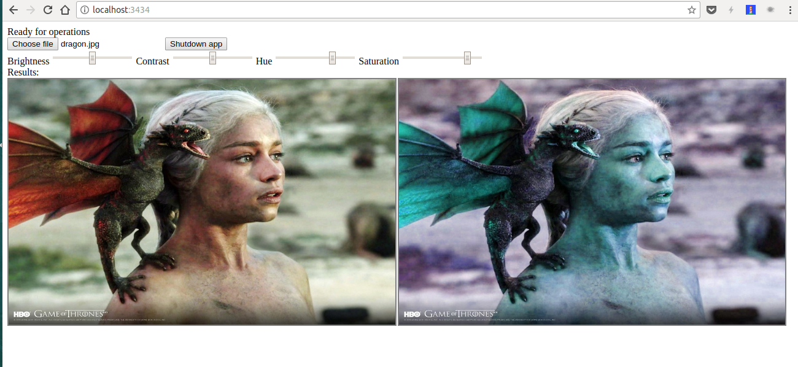

# shimmer 

> “The shimmer is a prism but it refracts everything.”- Annihilation (2018)

Image transformation in wasm using Go.

Just a demo project done on a weekend to play with images inside the browser using WASM. Use the Go compiler at tip. Performance lag is noticeable for images over 100KB.

### Setup

- Edit the Makefile to point to your tip compiler.
- Run `make`
- Serve the files using any HTTP server. (Note that .wasm files need to be served with `application/wasm` mime type. So the server must be capable of doing that.)

### Benchmarks

name         time/op
AdjustImage   249ms ± 4%

name         alloc/op
AdjustImage  2.44MB ± 0%

name         allocs/op
AdjustImage    62.0 ± 0%

